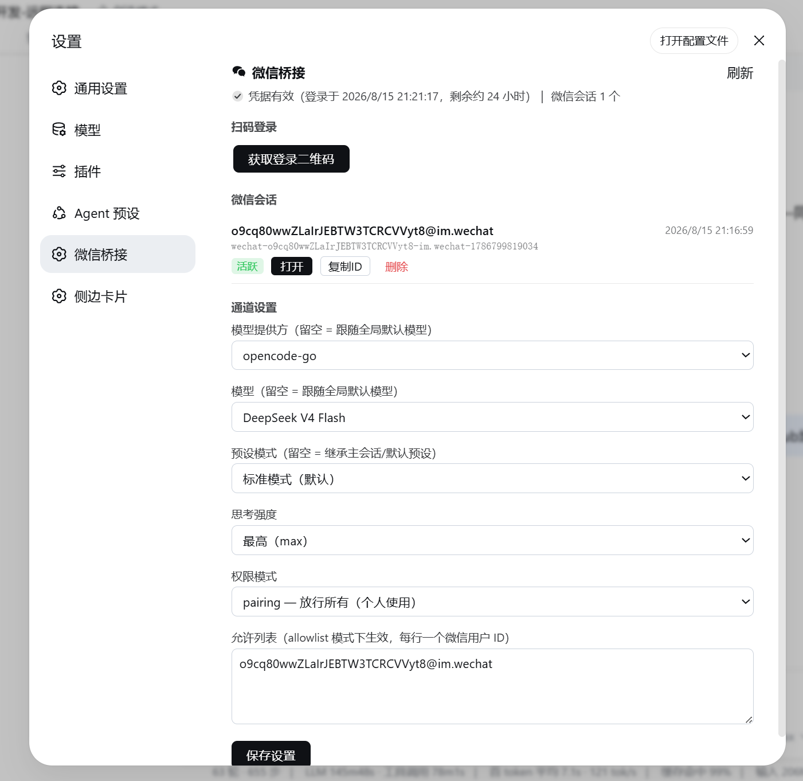

# dsh-wechat-bridge

微信 **iLink ClawBot**（腾讯官方微信 Bot 协议）远程桥接插件，把微信消息接进 DeepSeek Harness（dsh）。

## 特性

- 协议与 dsh API **均经实测**（iLink 真实端点 + dsh 0.1.0-rc.6 官方 Agent API）
- 长轮询收消息、`msg` 包裹 + `text_item` 发送（官方格式）
- **发送必须带 `base_info.channel_version` + `from_user_id` + `client_id`**——实测缺失时服务器返回 message_id 但**不投递**（对照 openclaw-weixin 参考实现定位）
- 每个微信用户独立 dsh 会话（`agents.create({ sessionId })` + `agent.followup`）
- **回复自动转发**：wechat 会话每轮 agent 的最终文字回复自动发回微信（监听 `session/event`，按 `user/message` 真实来源过滤上下文快照）
- `wechat_reply` 工具用于主动推送（任务完成通知等），同一轮内已用工具发送则自动转发跳过，避免重复
- 会话级提示词：wechat 会话的 agent 会收到「正在通过微信对话」的上下文（按会话 id 条件注入，不影响其他会话）
- **Web 设置界面**（设置 → 微信桥接）：扫码登录、模型/预设/思考强度/权限配置、会话列表（打开/复制/删除）、凭据状态
- **自动续期**：iLink 会话约 24h（服务端限制），到期前自动把新二维码推送到微信，扫码无缝续期，全程不断线
- 错误落盘 `stateDir/errors.log`

## 已知限制

- **重启后会话不续接**：桥接按 `wechat-<userId>-<时间戳>` 新建会话，dsh web 重启后同一微信用户会开新会话（旧会话历史保留在侧边栏，但桥接不再关联）
- 图片/语音等非文本消息以占位文本 `[非文本消息]` 呈现，当前通道不接收媒体内容
- 修改插件代码后需要重启 `dsh web` 才生效（HMR 不重载 node_modules 里的模块）

## 安装

从 GitHub 安装（发布版）：

```sh
dsh plugin --profile web add "github:Qshuai0213/dsh-wechat-bridge"
```

本地开发安装：

```sh
dsh plugin --profile web add "file:D:/ai工作区/dsh-wechat-bridge"
```

插件自带 `dsh.bundle.patch`（`cordis.patch.yml`），安装后**自动挂载**，无需手动编辑
profile 的 `cordis.patch.yml`。配置走 schema 默认值：`stateDir` 默认为
`$DSH_HOME/channels/wechat`（无 `DSH_HOME` 时 `~/.dsh/channels/wechat`）、`dmPolicy: pairing`。
需要覆盖时在 profile patch 里按 id 追加 `config`：

```yaml
- insert:
    - id: wechat-bridge
      config:
        dmPolicy: allowlist
        allowFrom: ['o9cq80wwZLaIrJEBTW3TCRCVVyt8@im.wechat']
```

重启 `dsh web`。

## 登录

iLink 会话有效期约 **24 小时**（服务端限制，无法延长），插件内置**自动续期**：到期前约 2 小时，插件会把新的续期二维码链接推送到微信（发给最近活跃的会话），点开链接扫码即可无缝续期，全程不断线；最后 30 分钟未续期会再次提醒。

三种登录方式任选：

1. **Web 界面扫码**：打开 **设置 → 微信桥接**，点「获取登录二维码」，用手机微信扫码并确认，凭据自动写入并开始收消息。
2. **微信内点链接续期**（到期前自动推送，推荐）：收到「登录凭据将于约 X 小时后过期」消息后，点击其中的链接扫码确认即可。
3. **命令行**：

```sh
node node_modules/dsh-wechat-bridge/login.mjs "<你的 stateDir>"
```

stateDir 默认为 `$DSH_HOME/channels/wechat`（无 `DSH_HOME` 时 `~/.dsh/channels/wechat`）。
手机微信打开输出的链接扫码授权，凭据写入 `credentials.json`。

## 使用

微信里给 ClawBot 发第一条消息 → dsh 出现 `wechat-*` 会话 → agent 回复自动发回微信。

## 设置界面（Web UI）

微信功能无独立界面入口，全部集成在 dsh Web 的 **设置 → 微信桥接** 页面（重启 `dsh web` 后出现），包含三个区块：



- **扫码登录**：生成/轮询登录二维码，凭据状态与登录结果实时显示
- **微信会话**：列出全部微信会话（活跃/空闲、打开、复制 ID、删除）
- **通道设置**：可调整并持久化到 `settings.yaml`：

| 设置项 | 说明 |
|---|---|
| 模型提供方 / 模型 | 微信会话使用的模型；留空 = 跟随全局默认模型选择 |
| 思考强度 | `off / low / medium / high / max`，留空 = 跟随默认 |
| 权限模式 | `pairing`（放行所有）/ `allowlist`（仅允许列表）/ `disabled`（关闭通道） |
| 允许列表 | allowlist 模式下生效，每行一个微信用户 ID |

- 权限模式与允许列表**即时生效**；模型/思考强度对**之后新建**的微信会话生效（已有会话不变）
- 页面同时显示凭据状态（登录时间、剩余有效期、活跃会话数）；剩余不足 2 小时时插件会自动向微信推送续期二维码
